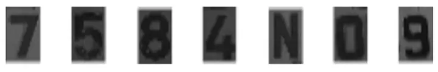
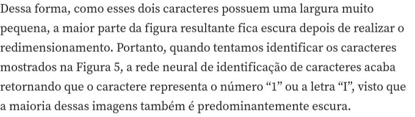
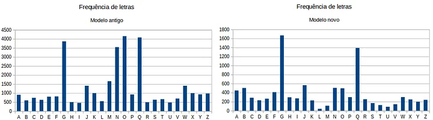
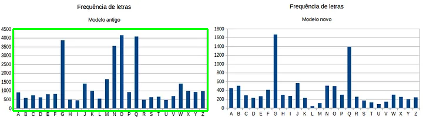
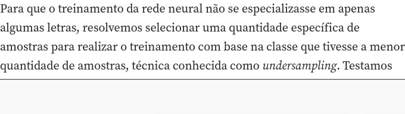

# Relatório de Testes da Leitura de Placas

## Teste 1: placa_teste_4_artigo.webp

- Imagem Original: `test_images/placa_teste_4_artigo.webp` (Cópia salva em: `teste_1_placa_teste_4_artigo_original.png`)

- Imagem Processada (Placa Destacada): `teste_1_placa_teste_4_artigo_destacada.png`

- Texto Extraído: **Placa não localizada na imagem.**
- Coordenadas da Placa (x,y,w,h): `Não detectada`

---

## Teste 2: placa_teste_5_artigo.png

- Imagem Original: `test_images/placa_teste_5_artigo.png` (Cópia salva em: `teste_2_placa_teste_5_artigo_original.png`)

- Imagem Processada (Placa Destacada): `teste_2_placa_teste_5_artigo_destacada.png`

- Texto Extraído: **Placa não localizada na imagem.**
- Coordenadas da Placa (x,y,w,h): `Não detectada`

---

## Teste 3: placa_teste_2_artigo.webp

- Imagem Original: `test_images/placa_teste_2_artigo.webp` (Cópia salva em: `teste_3_placa_teste_2_artigo_original.png`)

- Imagem Processada (Placa Destacada): `teste_3_placa_teste_2_artigo_destacada.png`

- Texto Extraído: **Texto não extraído**
- Coordenadas da Placa (x,y,w,h): `(22, 49, 331, 140)`

---

## Teste 4: placa_teste_1_artigo.jpeg

- Imagem Original: `test_images/placa_teste_1_artigo.jpeg` (Cópia salva em: `teste_4_placa_teste_1_artigo_original.png`)

- Imagem Processada (Placa Destacada): `teste_4_placa_teste_1_artigo_destacada.png`

- Texto Extraído: **Placa não localizada na imagem.**
- Coordenadas da Placa (x,y,w,h): `Não detectada`

---

## Teste 5: placa_teste_3_artigo.png

- Imagem Original: `test_images/placa_teste_3_artigo.png` (Cópia salva em: `teste_5_placa_teste_3_artigo_original.png`)

- Imagem Processada (Placa Destacada): `teste_5_placa_teste_3_artigo_destacada.png`

- Texto Extraído: **Placa não localizada na imagem.**
- Coordenadas da Placa (x,y,w,h): `Não detectada`

---

